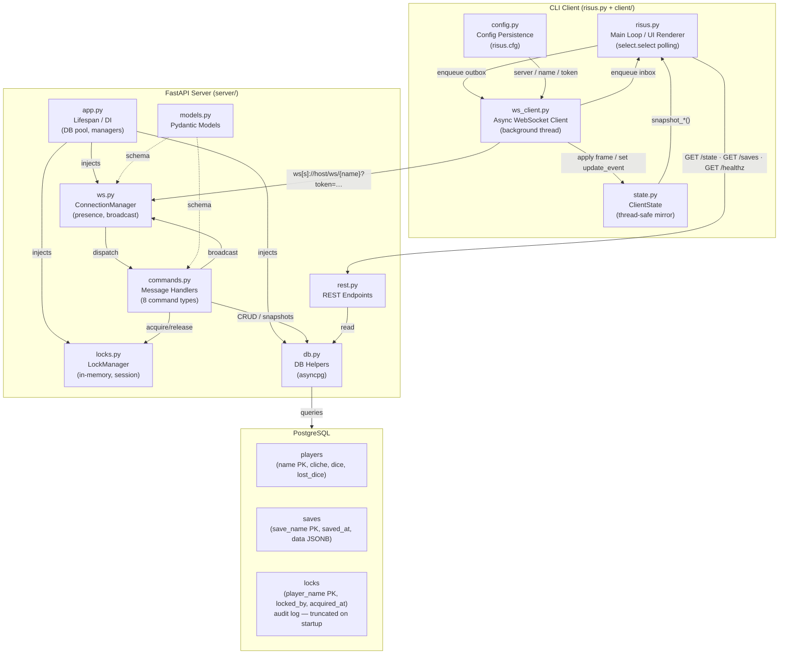
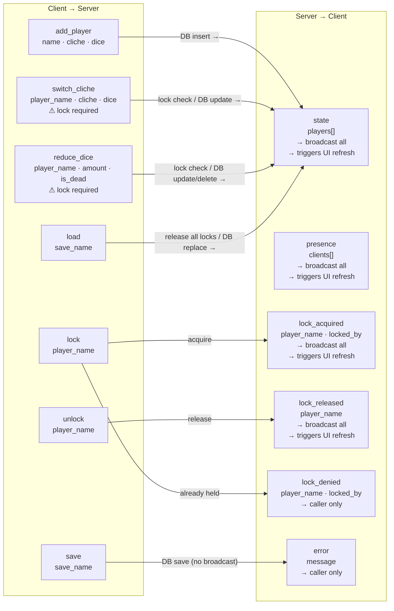
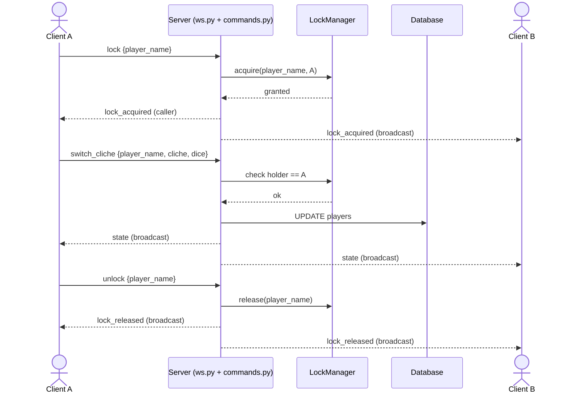
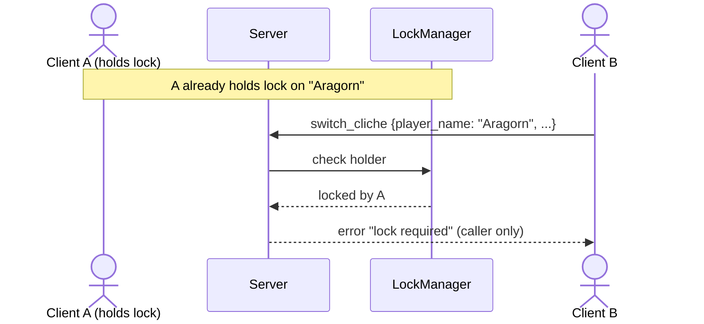
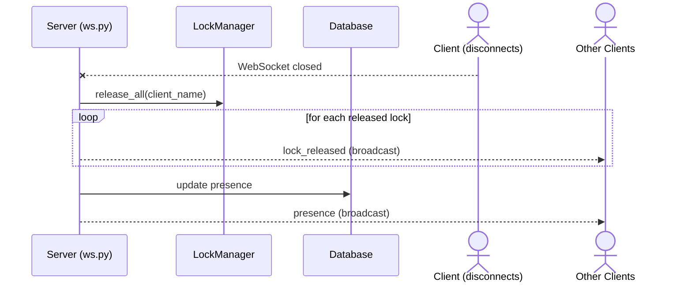
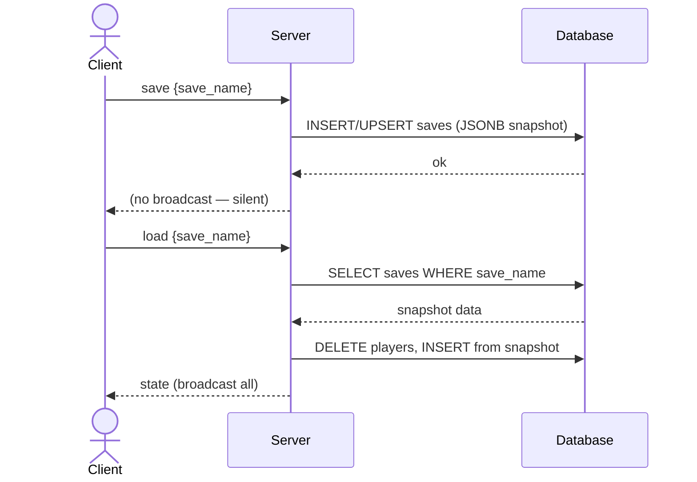
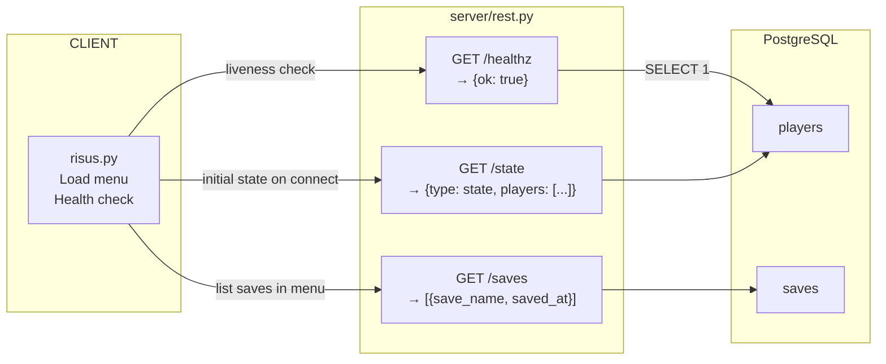
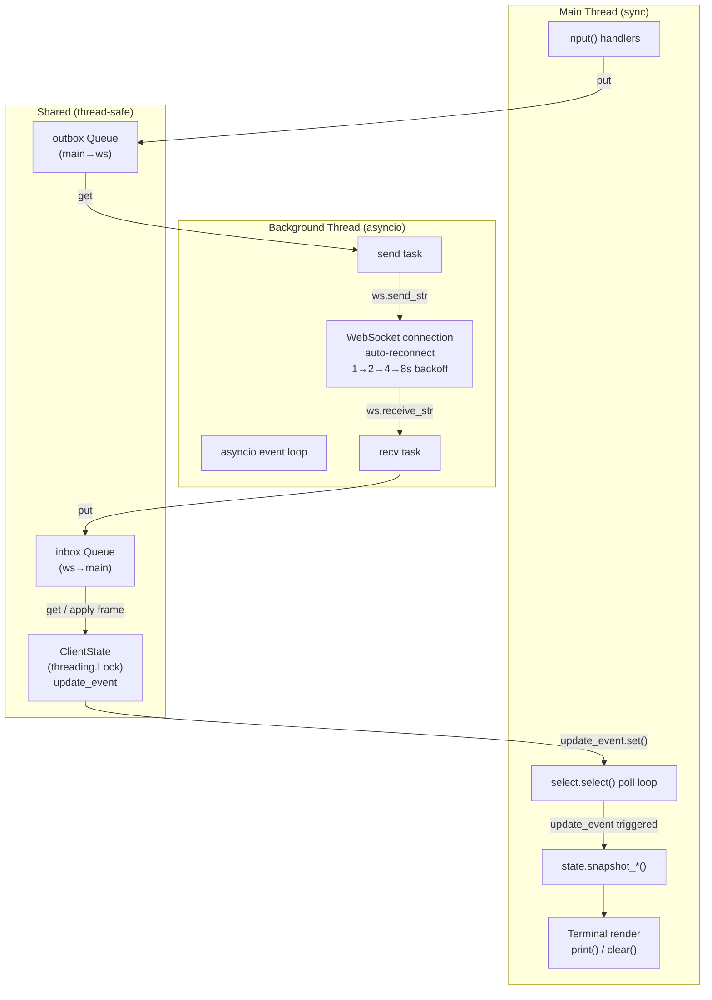

# Component Communication Architecture

Risus CLI — multiplayer battle tracker. Pure CLI client + FastAPI server over WebSocket and REST.

---

## System Overview

---

## WebSocket Message Protocol

---

## Key Interaction Flows

### Lock → Edit → Unlock

### Concurrent Edit — Lock Denied

### Client Disconnect — Auto Release

### Save / Load

---

## REST Endpoints

---

## Threading Model

