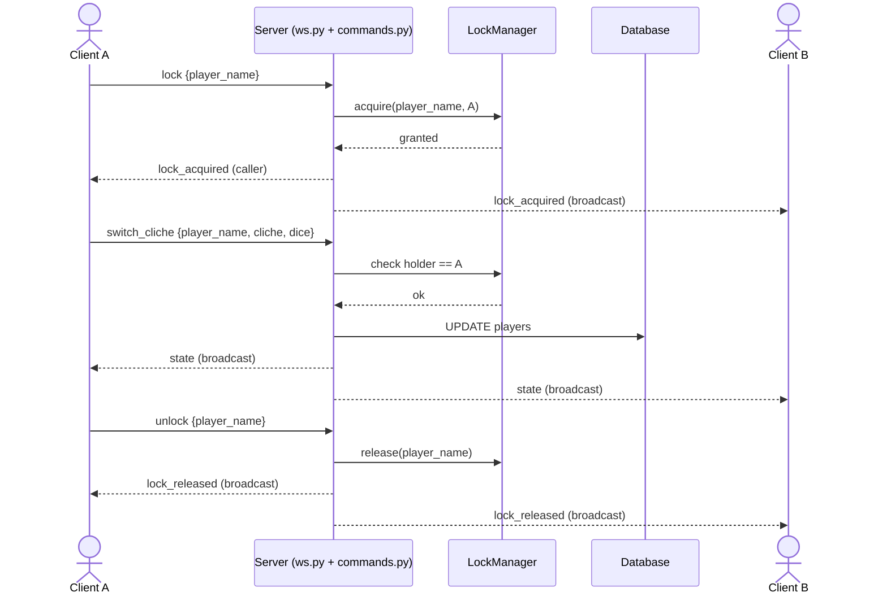
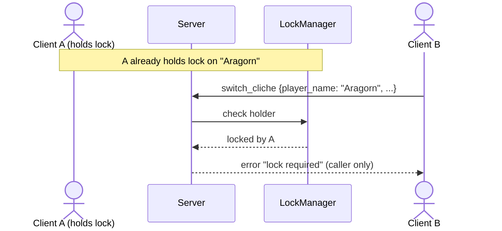
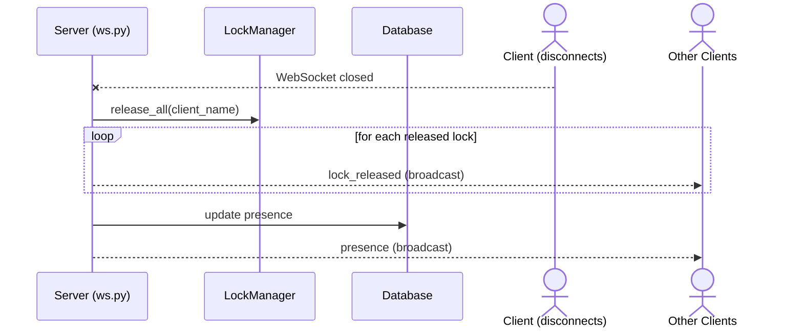
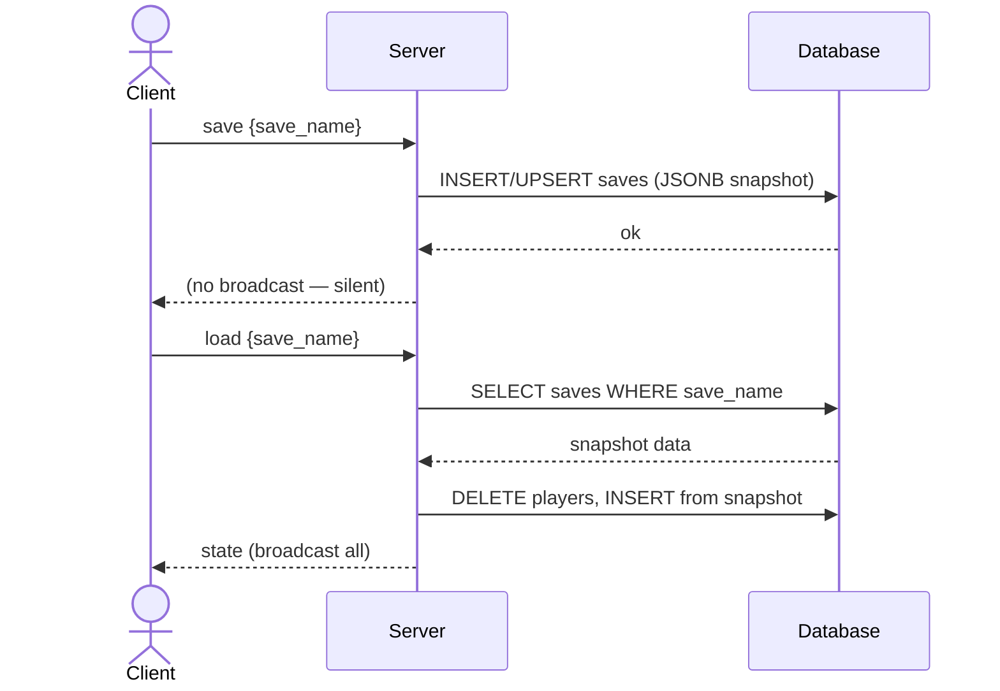

# Key Interaction Flows

Four sequence diagrams covering the most important runtime scenarios. The first shows the happy path: a client acquires a lock, edits a player, then releases the lock, with broadcasts propagating to other clients at each step. The second shows concurrent conflict: a second client attempts an edit on an already-locked player and receives a private error. The third shows automatic cleanup: when a client disconnects the server releases all its held locks and broadcasts presence/lock updates. The fourth shows persistence: a client saves the current battle state to a named snapshot or restores one, replacing all live player data.

---

## Lock → Edit → Unlock

## Concurrent Edit — Lock Denied

## Client Disconnect — Auto Release

## Save / Load

