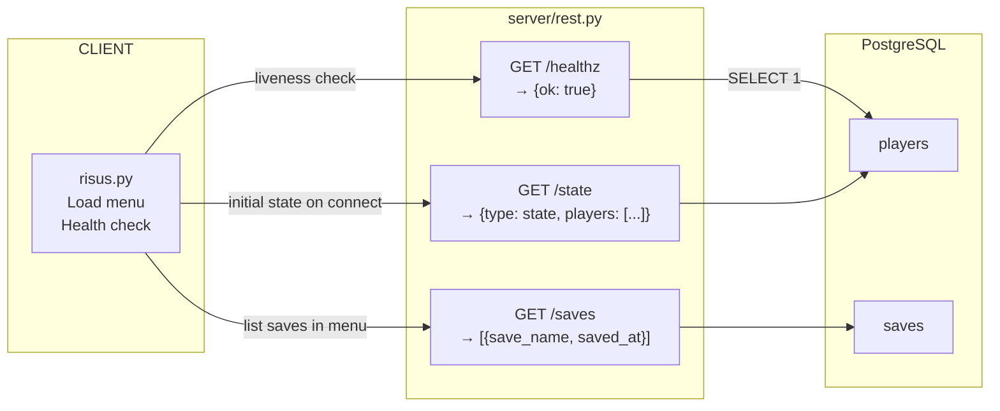

# REST Endpoints

Shows the three HTTP endpoints exposed by `server/rest.py` and the CLI code paths that call them. The client calls `/healthz` for liveness checks, `/state` to load the current player list on startup, and `/saves` to populate the load-battle menu. Each endpoint is backed directly by a PostgreSQL table — `players` for healthz and state, `saves` for the saves listing.

---

