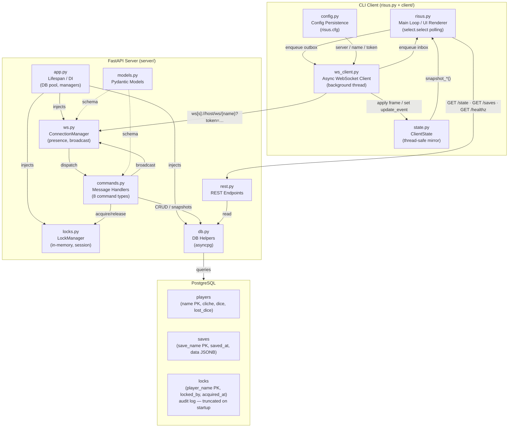

# System Overview

Shows all major components of the Risus CLI system and how they connect. The CLI client subgraph contains the main loop, WebSocket client, state mirror, and config reader. The FastAPI server subgraph groups connection management, command dispatch, lock management, REST endpoints, DB helpers, and Pydantic models. PostgreSQL sits at the bottom holding three tables. Arrows show data flow: WebSocket frames between client and server, REST calls for initial state and saves listing, and SQL queries to the DB.

---

