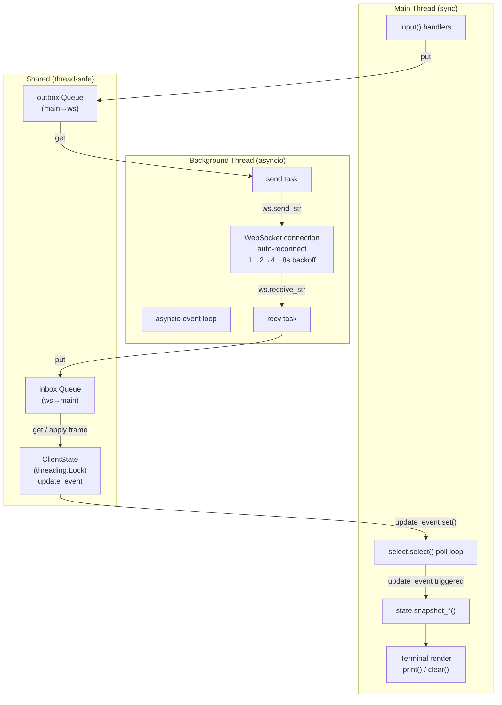

# Threading Model

Shows how the CLI client splits work across two threads. The main thread runs a synchronous `select.select()` poll loop that handles user input and terminal rendering. A background thread runs an asyncio event loop managing the WebSocket connection with automatic exponential-backoff reconnect. The two threads communicate through two thread-safe queues (outbox: main→ws, inbox: ws→main) and a `ClientState` object protected by a `threading.Lock`. The `update_event` flag wakes the main loop whenever the server pushes new state.

---

