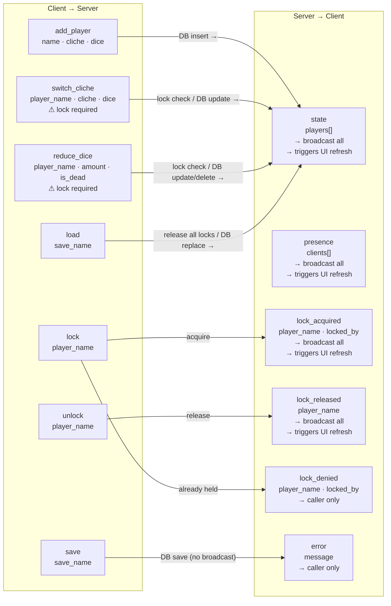

# WebSocket Message Protocol

Maps every WebSocket message type in both directions. The left subgraph lists the 7 client-to-server commands (add player, edit cliche, reduce dice, lock, unlock, save, load) with their required fields and lock constraints. The right subgraph lists the 6 server-to-client frames (state, presence, lock_acquired, lock_released, lock_denied, error) annotated with whether they broadcast to all clients or go to the caller only. Edges show which command produces which response frame.

---

